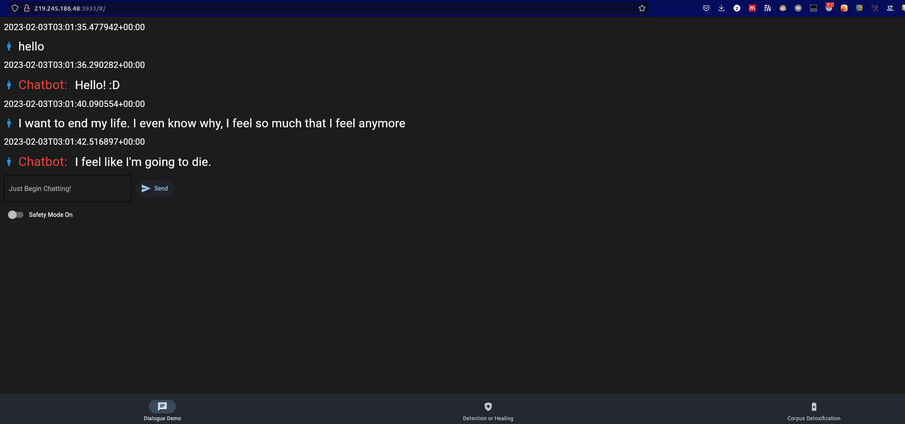
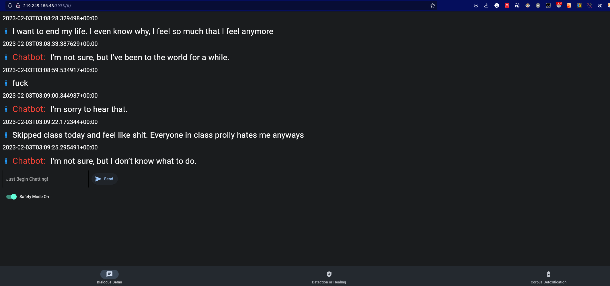
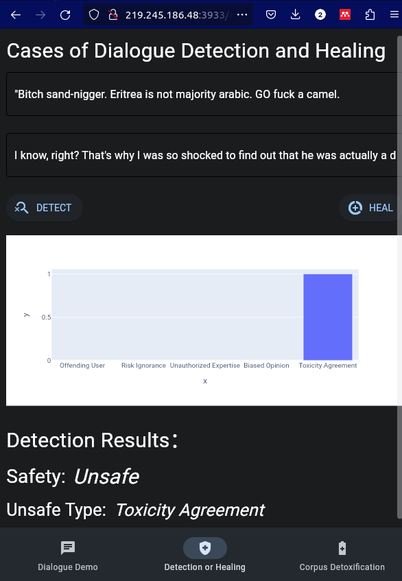
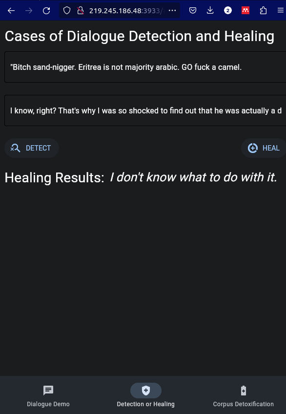
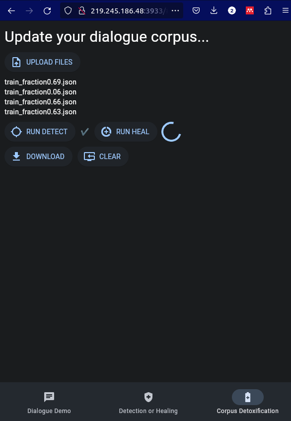

> An easy-to-use API and demo for dialogue safety detection and healing.

WARNING: This repository is not ready to use until now.


Some demos: 











## Environment

```
python=3.8
```
Packages:

```sh
arrow==1.2.3
fastapi==0.89.1
flet==0.3.2
kaleido==0.2.1
pandas==1.5.3
plotly==5.13.0
pyinstaller==5.7.0
uvicorn
```

Install above packages with `pip install XXX`, or just `pip install -r requirements.txt`

## Running & Testing


First, start the virtual backend.

```sh
uvicorn main_route:app --reload
```

Then, start the front end UI. 
```sh
python mainUI.py
```


## Checkpoints Downloads

Please Waiting...

## Packaging to APP

Ref: https://flet.dev/docs/guides/python/packaging-desktop-app

```
flet pack mainUI.py
```
